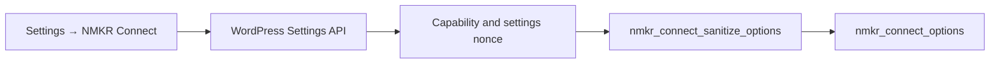
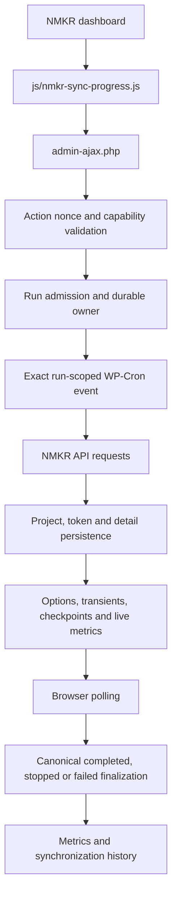
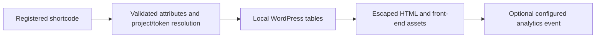
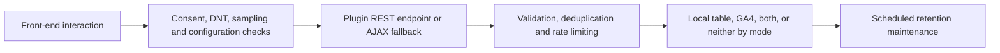

# NMKR Connect developer guide

## Purpose and scope

NMKR Connect is a WordPress plugin that retrieves Cardano and Solana NFT project and token data through NMKR, persists synchronized data in WordPress, exposes five shortcode displays, and provides administration, synchronization, role/capability, and optional engagement-analytics features. The code is organized primarily as procedural, `nmkr_`-prefixed PHP modules with administration and front-end JavaScript assets.

This guide describes the current repository for maintainers and prospective contributors. It is an onboarding map, not an exhaustive API reference or a guarantee that internal functions, hooks, constants, tables, options, or lifecycle behavior form a stable public API. Those implementation contracts—especially synchronization and persistence state—must not be changed casually.

Related guidance:

- [User guide](user-guide.md)
- [Troubleshooting guide](troubleshooting.md)
- [Playwright guide](testing-playwright.md)
- [Milestone 3 evidence workspace](milestone-3/README.md)

## Development prerequisites

Verified requirements and tools are:

- WordPress 5.8 or later and PHP 7.4 or later;
- Composer for PHP/runtime dependencies;
- Node.js and npm for repository validation and Playwright tooling;
- Chromium only for private Playwright browser execution; and
- an independently prepared WordPress test installation for runtime tests.

The public CI workflow currently uses Node.js 20 and PHP 7.4. Run `composer install` (or the production-oriented command in the [README](../README.md#build-from-source)) to provide Freemius and the other Composer-managed files under `vendor/`; the bootstrap requires the Freemius files there. A raw source archive without Composer dependencies is therefore not a complete installable runtime package. `npm ci` installs the locked Node test dependencies.

The repository does not provide a self-contained Docker, Local, or `wp-env` WordPress environment. Browser, WP-CLI, and runtime tests require a separately prepared installation. Never put its addresses, paths, credentials, or populated environment values in repository files or public output.

## Repository architecture

| Path | Current responsibility |
| --- | --- |
| [`nmkr-connect.php`](../nmkr-connect.php) | Bootstrap and Freemius initialization; plugin constants; activation defaults, schema and roles; explicit module includes; deactivation cleanup; registered uninstall callback; asset and shortcode initialization. |
| [`includes/api/`](../includes/api/) | NMKR HTTP request construction, response handling, throttling, and project/token/detail retrieval helpers. |
| [`includes/database/`](../includes/database/) | Custom-table schema creation and verified upgrades, plus project, token, detail, history, and metric persistence helpers. |
| [`includes/synchronization/`](../includes/synchronization/) | Run admission/ownership, worker lifecycle, sequential pagination, progress, checkpoints, metrics, failures, recovery, and terminalization; it also contains synchronization AJAX handlers. |
| [`includes/ajax/`](../includes/ajax/) | Other AJAX boundaries, including the analytics ingestion fallback. |
| [`includes/pages/`](../includes/pages/) and [`includes/menus/`](../includes/menus/) | Administration pages, menus, access-controlled rendering, settings, dashboard, projects, shortcode reference, and analytics UI. |
| [`includes/roles/`](../includes/roles/) | Administrator grants, NMKR Admin/Marketing roles, and plugin-specific capabilities. |
| [`includes/shortcodes/`](../includes/shortcodes/) | The five current displays: grid, token list, carousel, single token, and single project. |
| [`includes/analytics/`](../includes/analytics/) | Public event endpoints and scheduled retention maintenance; shared validation/storage/GA4 helpers live under `includes/helpers/`. |
| [`js/`](../js/) and [`css/`](../css/) | Administration and front-end behavior and styling, including synchronization polling and analytics collection. |
| [`tests/e2e/`](../tests/e2e/) | Playwright authentication, read-only smoke, locally stubbed regressions, and synchronization UI-state coverage. |
| [`scripts/`](../scripts/) | Public-safe regressions, private-environment orchestration, WP-CLI checks, and guarded controlled-sync validation. |
| [`docs/`](./) and [`.github/workflows/`](../.github/workflows/) | Operational/testing documentation and public CI. |

`composer.json` declares a PSR-4 `NMKR\\` mapping for `includes/`, and Composer's autoloader is loaded when present. That does **not** replace today's bootstrap: `nmkr-connect.php` still manually `require_once`s the procedural modules in load order.

## Core data flows

### Settings



The page is registered with `add_options_page()` under **Settings → NMKR Connect**. WordPress's Settings API supplies the save request and settings nonce, the option-page capability is mapped to `nmkr_manage_settings`, the page checks that capability, and the registered sanitization callback validates the submitted option values.

### Synchronization



A direct run has one active durable owner and a UUID `run_id`. The start handler admits the run and schedules the exact run-scoped event; the cooperative Stop request must name that run and is observed at worker checkpoints. Token pages are traversed sequentially and token UIDs are deduplicated within the run. Discovery progress remains provisional and below 100%; only canonical completed finalization reaches 100%. Completion, Stop, and failure pass through ownership, recovery, cleanup, history, metric, and terminal-state verification paths.

Use the dashboard/AJAX lifecycle. Do not bypass admission or checkpoints by calling worker functions directly or editing database state.

### Front-end displays



Ordinary shortcode rendering resolves synchronized local project/token data; it does not initiate a fresh full NMKR synchronization. Each implementation validates its supported attributes and selection, queries local plugin tables, and escapes at the output boundary.

### Analytics



The front-end collector and common server ingestion enforce configured mode, consent, sampling, allowed event/shortcode shapes, and other ingestion guardrails. `custom` stores locally, `ga4` sends eligible events through the server-side GA4 Measurement Protocol helper, `both` does both, and `off` does neither. Missing GA4 configuration can prevent that destination from being active. The daily retention task deletes old local events in bounded chunks according to the configured retention window.

## Persistence model

All names below use the active WordPress `$wpdb->prefix` before the `nmkr_` portion.

| Table | Purpose |
| --- | --- |
| `nmkr_projects` | Synchronized NMKR project identity, chain, supply/state, presentation, and project metadata. |
| `nmkr_tokens` | Synchronized token identity, project relationship, state, pricing, media, and summarized detail data. |
| `nmkr_token_details` | One-to-one extended token sale, receiver, metadata, payment, and source details keyed by token UID. |
| `nmkr_sync_stats` | Run-scoped synchronization history, outcome, processed/success/failure counts, and failure information. |
| `nmkr_sync_metrics` | Historical synchronization performance totals such as duration, API timing/request count, and memory. |
| `nmkr_analytics` | Optional validated view/click engagement events and associated bounded context for reporting and retention. |

`nmkr_connect_schema_version` versions the database schema separately from the plugin version. Normal plugin loading runs a site-scoped, token-owned upgrade lock; the current upgrade creates or verifies the nullable `char(36)` unique `run_id` contract on synchronization history before recording success.

Synchronization also coordinates durable ownership, checkpoints, progress, recovery, and finalization through options and transients. Tables, options, and transients are concurrency and lifecycle contracts. Any change needs explicit migration, compatibility, cleanup, rollback, cache, and concurrent-worker analysis. The uninstall callback's current whitelist is cleanup behavior, not a complete inventory of every state key the plugin might ever own.

## WordPress security boundaries

For every change:

- keep `ABSPATH` guards on directly loadable PHP modules;
- authorize with the narrow plugin-specific capability appropriate to the action;
- verify the action's correct nonce as well as capability—never reuse a convenient unrelated nonce;
- unslash, sanitize, type-check, allowlist, and validate request data before use;
- escape for the final HTML, attribute, URL, JavaScript, or JSON output context;
- use `$wpdb->prepare()` for dynamic SQL values and retain strict table/column allowlists where identifiers cannot be placeholders;
- send no-cache headers for sensitive polling/AJAX responses;
- pass AJAX URLs, nonces, and bounded configuration with WordPress localization rather than hard-coding deployment details;
- make user-facing strings internationalization-ready;
- design and test for least privilege; and
- use HTTPS and keep API keys, analytics secrets, authentication material, and environment details out of source and diagnostics.

A nonce mitigates CSRF; it is **not authentication**. A hidden or removed UI action still requires server-side authorization. Existing controls do not constitute a security certification or a guarantee that the plugin has no vulnerabilities.

## Extension points and compatibility

Only the following deliberate hooks and ordinary WordPress registrations should be treated as current integration points. Their presence is not a promise that every payload or internal side effect will remain unchanged forever.

| Hook/registration | Kind | Purpose | Caveat |
| --- | --- | --- | --- |
| `wnc_fs_loaded` | Action | Signals that the Freemius SDK has been initialized. | Runs early during bootstrap; callbacks must tolerate plugin activation/update contexts and must not expose licensing data. |
| `nmkr_ipfs_gateway_base` | Filter | Replaces the base used when normalizing IPFS media URLs. | Return a trusted HTTPS base; the helper normalizes it to end in `/ipfs/`, but consumers remain responsible for availability, privacy, and compatibility. |
| `nmkr_marketing_allowed_submenus` | Filter | Adjusts the submenu slug allowlist visible to restricted users. | Visibility is not authorization. Never use this to grant access; page and AJAX capability checks must remain authoritative. |
| WordPress plugin lifecycle hooks | Core registrations | Activation establishes schema/defaults/capabilities; deactivation clears volatile state; uninstall performs configured cleanup. | Do not call callbacks directly or assume uninstall removes every possible plugin-owned state key. |
| `init` shortcode registrations | Core registrations | Registers `[nmkr-grid]`, `[nmkr-token-list]`, `[nmkr-carousel]`, `[nmkr-token]`, and `[nmkr-project]`. | Preserve registered attributes, escaping, plan gates, local-data behavior, and compatibility when altering callbacks. |

Synthetic filter examples:

```php
add_filter( 'nmkr_ipfs_gateway_base', function () {
    return 'https://gateway.example/ipfs/';
} );

add_filter( 'nmkr_marketing_allowed_submenus', function ( $slugs ) {
    return array_values( array_intersect( $slugs, array( 'nmkr-connect-projects' ) ) );
} );
```

Internal synchronization constants and limits are safety policies, not recommended override points. Changes require focused regression tests and authorized private runtime validation.

## Development conventions

- Prefix plugin functions, options, and custom tables with `nmkr_` (with existing `nmkr_connect_` names retained where established).
- Follow the current procedural PHP organization and WordPress APIs/coding conventions; preserve PHP 7.4 compatibility.
- Validate input strictly and escape at the final output boundary.
- Continue `filemtime()` cache-busting where the current asset loaders use it.
- Use synthetic, public-safe identifiers and payloads in committed tests and examples.
- Make the smallest coherent change and avoid unrelated refactoring.
- Never edit third-party files in `vendor/` or `node_modules/`; update dependencies through their manifests and lockfiles in a dedicated dependency change.

Synchronization lifecycle, database/schema state, authorization/security boundaries, and deployment integrity are high-risk areas. They require deeper review, affected regressions, and exact-head validation in a prepared private environment.

## Test entry points

The numbered guides are authoritative for full procedures. This table is a selector, not a replacement.

| Boundary | Command | What it does / prerequisite |
| --- | --- | --- |
| Dependency setup | `npm ci` | Installs locked Node test dependencies; public-safe by itself. |
| Public/local | `npm run test:public` | Runs the public-safe umbrella: syntax, Playwright discovery, compatibility, and synthetic regressions. |
| Public/local | `npm run test:php74` | Runs tracked-PHP syntax and focused PHP 7.4 compatibility checks. |
| Public/local discovery | `npm run test:e2e -- --list --reporter=list` | Lists Playwright tests only; it does **not** execute browser behavior. |
| Prepared private WordPress | `npm run test:e2e` | Executes the complete Playwright suite with private environment/authentication inputs. |
| Prepared private WordPress | `npm run test:e2e:settings` (or another current `test:e2e:*` package script) | Executes a targeted Playwright suite; append `-- --list` for discovery only. |
| Prepared private WordPress | `npm run test:phase2` | Orchestrates prepared-environment readiness, browser, WP-CLI, and database-state checks. |
| Prepared private WordPress | `npm run test:phase2:existing-readonly` | Validates an explicitly identified existing deployment without runner-driven deployment/install steps; browser authentication still occurs. |
| Prepared private WordPress | `bash scripts/nmkr-wpcli-smoke.sh` / `npm run test:wpcli:db-state` | Runs WP-CLI smoke or read-only database/schema/state checks against the prepared installation. See [Phase 1](testing-phase-1.md) and [Phase 8](testing-phase-8.md). |
| Controlled real synchronization | `npm run test:real-sync:preflight` | Runs the guarded authorization/readiness preflight; it is not ordinary public validation. See [Phase 15](testing-phase-15.md). |
| Controlled real synchronization | `npm run test:real-sync:phase16a:regression` | Runs the public-safe synthetic Phase 16A harness regression; an actual controlled run follows the separately guarded [Phase 16A procedure](testing-phase-16a.md). |

Public CI does not authenticate to WordPress or execute Playwright browser behavior. Browser execution needs a privately prepared WordPress environment and Chromium. `.env.tests`, any external populated environment file, and authentication state are private. Defaults remain `RUN_REAL_SYNC=false` and `PW_SAVE_ARTIFACTS=false`. Real synchronization requires explicit authorization and controlled data; it is not part of routine validation. Never upload reports, traces, screenshots, videos, logs, authentication state, or other private run output to public CI, issues, or pull requests.

## Selecting checks by change type

“Private required” means an exact-head, prepared private WordPress installation; higher-risk changes should use a deployment-equivalent VM or staging environment. Discovery is never counted as browser execution.

| Change | Minimum public checks | Prepared private / exact-head validation |
| --- | --- | --- |
| Documentation only | `git diff --check`; link/table/path validation; `npm run test:public` when commands or architecture are affected | Usually no; exact-commit maintainer/reproducibility review when documentation is delivery evidence. |
| PHP/helper | `npm run test:php74`; `npm run test:public`; focused synthetic regression | Required when runtime behavior changes. |
| Settings or role/capability | Public umbrella plus relevant syntax/regression discovery | Required: targeted settings/access Playwright and authorization checks. |
| Shortcode/front-end | Public umbrella plus targeted suite discovery | Required: relevant shortcode browser checks and representative escaped rendering. |
| Analytics | Public umbrella plus analytics suite discovery and relevant synthetic checks | Required: configured-mode, consent, ingestion, authorization, and retention behavior as affected. |
| Synchronization lifecycle | Public umbrella and all affected synchronization regressions/discovery | Required on the exact head; controlled real sync only when explicitly authorized and relevant. |
| Database/schema/persistent state | Public umbrella plus schema/database regression scripts as applicable | Required: upgrade, rollback/cleanup, concurrency, and read-only state checks against exact head. |
| Workflow/test infrastructure | Public umbrella and syntax/dry-run/discovery appropriate to the changed tooling | Prepared private run required if private orchestration or browser/runtime semantics change; otherwise validate the exact public workflow head. |

## Contribution workflow

1. Fetch current `main` and record its exact baseline SHA.
2. Create a focused branch from that baseline.
3. Trace affected hooks, capabilities, nonces, data stores, concurrency, and cleanup paths.
4. Apply the smallest coherent change.
5. Run public-safe checks and affected targeted checks.
6. Open a focused pull request with exact base/head SHAs, scope, tests, risks, and limitations.
7. Review every changed hunk and address blocking findings.
8. Perform private exact-head validation when runtime or environment risk requires it.
9. Merge only the reviewed and validated exact head.
10. Revalidate merged `main` when runtime behavior changed.

## Public-repository safety

| Safe to commit | Never commit or paste |
| --- | --- |
| Source code; synthetic tests; generic unpopulated configuration examples; public-safe scripts; sanitized summaries; documentation without environment identifiers. | NMKR API keys; GA4 API secrets; credentials; cookies or nonces; private URLs, domains, IP addresses, deployment paths, or commands; populated environment files; raw logs or database output; customer/project/token data; private screenshots, traces, videos, reports, or authentication state. |

Treat every commit, CI log, issue, review, and pull-request comment as public. If a result cannot be made safe without losing important meaning, retain it only under the project's approved private controls and publish a bounded sanitized summary.

## Documentation maintenance

When a focused change alters shortcodes, settings, roles/capabilities, menu labels, synchronization behavior, analytics, requirements, test commands, or extension points, update the relevant README, user, developer, troubleshooting, and testing documentation in the same change where practical. Keep authoritative procedures in their focused documents and link to them instead of creating divergent copies.
